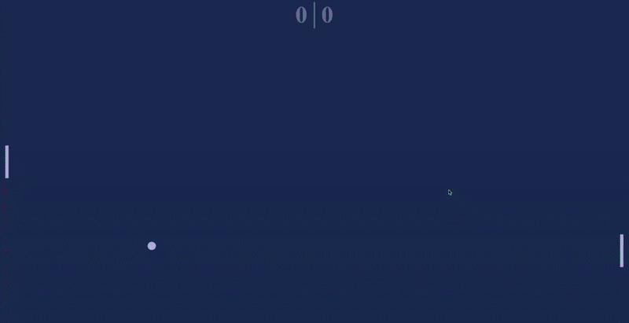

# Pong

A modern, web-based recreation of the classic Pong arcade game built with vanilla JavaScript, HTML5, and CSS3. Features smooth animations, physics-based ball movement, an AI opponent, and a dynamic color-shifting interface. No frameworks required—pure JavaScript showcasing modern ES6+ modules and the Canvas-free CSS positioning approach.

## Demo



\*\*[Play Live Demo](https://a-maystorov.github.io/pong)

## Features

- **Classic Pong Gameplay**
  - Player vs AI single-player mode
  - Mouse-controlled player paddle
  - Smooth, responsive controls
  - Score tracking for both players

- **Modern Web Technologies**
  - Pure vanilla JavaScript (ES6+ modules)
  - CSS3 custom properties for dynamic styling
  - No frameworks or libraries required
  - Lightweight and fast

- **Advanced Visual Effects**
  - Dynamic hue-shifting color scheme
  - Smooth animations using `requestAnimationFrame`
  - Responsive design that scales to any screen size
  - Clean, minimalist aesthetic

- **Physics-Based Ball Movement**
  - Realistic velocity and direction
  - Progressive speed increase over time
  - Collision detection with paddles and walls
  - Random initial trajectory to prevent predictability

- **AI Opponent**
  - Smooth tracking algorithm
  - Follows ball position with realistic delay
  - Provides challenging but beatable gameplay
  - Interpolated movement for natural feel

## Technologies Used

- **HTML5** - Semantic structure
- **CSS3** - Custom properties (CSS variables), flexbox, viewport units
- **JavaScript (ES6+)** - Modules, classes, getters/setters, arrow functions
- **requestAnimationFrame** - Smooth 60 FPS animation loop
- **CSS Transforms** - Hardware-accelerated rendering

## How It Works

### Game Architecture

The game uses a **class-based architecture** with three main components:

1. **Ball Class** (`Ball.js`)
   - Manages ball position, velocity, and direction
   - Handles collision detection with paddles and walls
   - Implements progressive speed increase

2. **Paddle Class** (`Paddle.js`)
   - Controls paddle position
   - Provides AI movement logic
   - Exposes collision rectangles

3. **Main Game Loop** (`script.js`)
   - Orchestrates game updates
   - Handles input events
   - Manages score and game state

### CSS-Powered Positioning

Unlike traditional canvas-based games, this implementation uses **CSS custom properties** for positioning:

```javascript
// JavaScript sets CSS variables
set x(value) {
  this.ballElem.style.setProperty("--x", value);
}

// CSS uses variables for positioning
.ball {
  left: calc(var(--x) * 1vw);
  top: calc(var(--y) * 1vh);
}
```

**Benefits:**

- Hardware-accelerated rendering via CSS transforms
- Easy to style and modify
- Separation of concerns (logic vs presentation)
- No canvas API learning curve

### Physics System

**Ball Velocity:**

```javascript
const INITIAL_VELOCITY = 0.025;
const VELOCITY_INCREASE = 0.00001;

update(delta) {
  this.x += this.direction.x * this.velocity * delta;
  this.y += this.direction.y * this.velocity * delta;
  this.velocity += VELOCITY_INCREASE * delta;
}
```

The ball starts slow and gradually accelerates, increasing difficulty over time.

**Collision Detection:**

```javascript
function isCollision(rect1, rect2) {
  return (
    rect1.left <= rect2.right &&
    rect1.right >= rect2.left &&
    rect1.top <= rect2.bottom &&
    rect1.bottom >= rect2.top
  );
}
```

Axis-Aligned Bounding Box (AABB) collision detection checks rectangle overlap.

**Direction Randomization:**

```javascript
// Ensure ball doesn't move too horizontally or vertically
while (Math.abs(this.direction.x) <= 0.2 || Math.abs(this.direction.x) >= 0.9) {
  const heading = randomNumberBetween(0, 2 * Math.PI);
  this.direction = {
    x: Math.cos(heading),
    y: Math.sin(heading),
  };
}
```

This prevents boring straight vertical or horizontal trajectories.

### AI Algorithm

The computer paddle uses a **proportional tracking** algorithm:

```javascript
update(delta, ballHeight) {
  // Move toward ball position with proportional speed
  this.position += SPEED * delta * (ballHeight - this.position);
}
```

This creates smooth, human-like movement with a slight lag, making the AI beatable.

### Dynamic Color System

The hue continuously shifts, creating a mesmerizing visual effect:

```javascript
const hue = parseFloat(
  getComputedStyle(document.documentElement).getPropertyValue("--hue"),
);
document.documentElement.style.setProperty("--hue", hue + delta * 0.01);
```

All colors are derived from a single `--hue` variable using HSL color space.

## What I Learned

This project deepened my understanding of several web development concepts:

- **ES6 Modules**: Organizing code into importable, reusable classes. Understanding module scope and the `export`/`import` syntax.

- **CSS Custom Properties**: Using CSS variables for dynamic styling. Manipulating properties from JavaScript for real-time visual updates.

- **requestAnimationFrame**: Implementing smooth animations that sync with the browser's repaint cycle. Understanding delta time for frame-independent movement.

- **Game Loop Architecture**: Structuring an update loop that handles input, physics, collision detection, and rendering in the correct order.

- **AABB Collision Detection**: Implementing rectangle-based collision detection, a fundamental algorithm in 2D game development.

- **Viewport Units**: Using `vw` (viewport width) and `vh` (viewport height) for responsive game elements that scale with screen size.

- **Separation of Concerns**: Keeping game logic (JavaScript) separate from presentation (CSS) for maintainable code.

- **Object-Oriented JavaScript**: Using ES6 classes with getters/setters for clean, encapsulated code.

- **Trigonometry in Games**: Applying `Math.cos()` and `Math.sin()` to convert polar coordinates (angle, magnitude) to Cartesian (x, y) for ball direction.

## How to Run

### Option 1: Local Development

1. Clone this repository:

```bash
git clone https://github.com/a-maystorov/pong.git
cd pong
```

2. Start a local server (required for ES6 modules):

```bash
npx i -g live-server
npx live-server
```

**Using VS Code:**
Install the "Live Server" extension and click "Go Live"

3. Open browser to `http://localhost:8000`

### Option 2: GitHub Pages

This game works great on GitHub Pages:

1. Push code to GitHub
2. Go to repository Settings → Pages
3. Select branch and root folder
4. Visit your live site at `https://yourusername.github.io/pong`

### Project Structure

```
pong/
│
├── index.html           # HTML structure
├── style.css            # Styling and layout
├── script.js            # Main game loop and event handlers
├── Ball.js              # Ball class with physics
├── Paddle.js            # Paddle class with AI
```

## Controls

- **Mouse Movement**: Control your paddle (left side)
- The computer AI controls the right paddle automatically

## Game Rules

1. Ball bounces off top and bottom walls
2. Ball bounces off paddles
3. If ball passes your paddle: opponent scores
4. If ball passes opponent paddle: you score
5. Ball speed increases gradually over time
6. First to... well, there's no win condition—play forever!

## Configuration

Edit constants in the respective files to customize gameplay:

**Ball.js:**

```javascript
const INITIAL_VELOCITY = 0.025; // Starting ball speed
const VELOCITY_INCREASE = 0.00001; // Speed increase per frame
```

**Paddle.js:**

```javascript
const SPEED = 0.02; // AI paddle speed
```

**style.css:**

```css
:root {
  --hue: 200; /* Starting color hue (0-360) */
  --saturation: 50%; /* Color saturation */
}
```

## Browser Compatibility

- ✅ Chrome/Edge (Chromium) - Recommended
- ✅ Firefox
- ✅ Safari
- ⚠️ Requires ES6 module support (all modern browsers)
- ⚠️ Requires CSS custom properties support

## Code Highlights

### ES6 Module Pattern

```javascript
// Ball.js exports a class
export default class Ball {
  constructor(ballElem) {
    this.ballElem = ballElem;
  }
}

// script.js imports and uses it
import Ball from "./Ball.js";
const ball = new Ball(document.getElementById("ball"));
```

Clean, modular code with proper encapsulation.

### Getters and Setters

```javascript
get x() {
  return parseFloat(
    getComputedStyle(this.ballElem).getPropertyValue("--x")
  );
}

set x(value) {
  this.ballElem.style.setProperty("--x", value);
}
```

This provides a clean interface: `ball.x = 50` updates both JavaScript state and CSS.

### Frame-Independent Movement

```javascript
function update(time) {
  const delta = time - lastTime;
  ball.update(delta, paddleRects);
  // Movement = velocity * delta ensures consistent speed regardless of FPS
}
```

Delta time ensures the game runs at the same speed on different devices.

### Responsive Design with Viewport Units

```css
.paddle {
  width: 1vh; /* 1% of viewport height */
  height: 10vh; /* 10% of viewport height */
}

.ball {
  width: 2.5vh;
  height: 2.5vh;
  left: calc(var(--x) * 1vw); /* Percentage-based positioning */
  top: calc(var(--y) * 1vh);
}
```

Game scales perfectly to any screen size without media queries.

## Technical Challenges Solved

1. **ES6 Module Loading**: Understanding that modules require a server (can't open `file://` directly) and configuring local development.

2. **CSS-Based Animation**: Avoiding canvas in favor of DOM manipulation with CSS, proving that high-performance games don't always need canvas.

3. **Smooth AI Movement**: Implementing proportional control algorithm that creates human-like paddle movement rather than perfect tracking.

4. **Collision Detection**: Computing AABB collision between moving rectangles in a frame-independent way.

5. **Random But Fair Ball Direction**: Ensuring ball trajectory is random but never too steep or too flat.

6. **Dynamic Theming**: Creating a color scheme that shifts continuously using a single CSS variable.

## Why CSS Instead of Canvas?

This project deliberately uses **CSS positioning** rather than Canvas2D:

**Advantages:**

- Easier to style and theme
- Familiar HTML/CSS workflow
- Automatic browser optimizations
- Simpler debugging (inspect element works)
- No pixel manipulation code

**Trade-offs:**

- Less suitable for complex graphics
- More DOM elements = more memory
- Canvas would be better for 100+ moving objects

For a simple Pong game, CSS is perfectly sufficient and more accessible to web developers.

## Performance Considerations

- Uses `requestAnimationFrame` for optimal rendering sync
- CSS transforms are hardware-accelerated
- Minimal DOM manipulation (only position updates)
- No layout thrashing (reading computed styles is batched)

Runs smoothly at 60 FPS on any modern device.

## License

This project is open source and available under the [MIT License](LICENSE).

## Author

**Alkin Maystorov**

- GitHub: [@a-maystorov](https://github.com/a-maystorov)
- Portfolio: [alkinmaystorov.com](https://alkinmaystorov.com)
- LinkedIn: [Alkin Maystorov](https://linkedin.com/in/alkin-maystorov)

## Acknowledgments

- Inspired by the 1972 Atari classic _Pong_
- Built as part of learning modern web development and game programming
- CSS-based approach demonstrates that not all games need canvas
- ES6 module pattern showcases modern JavaScript best practices
